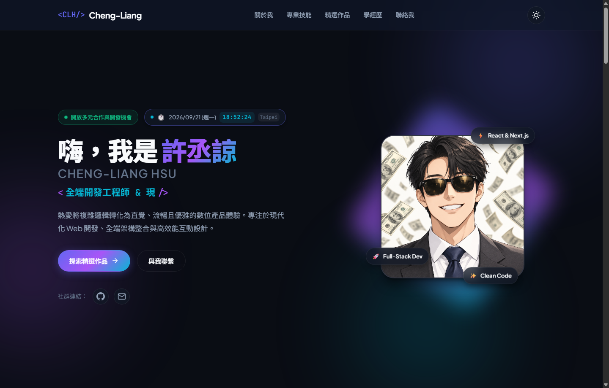
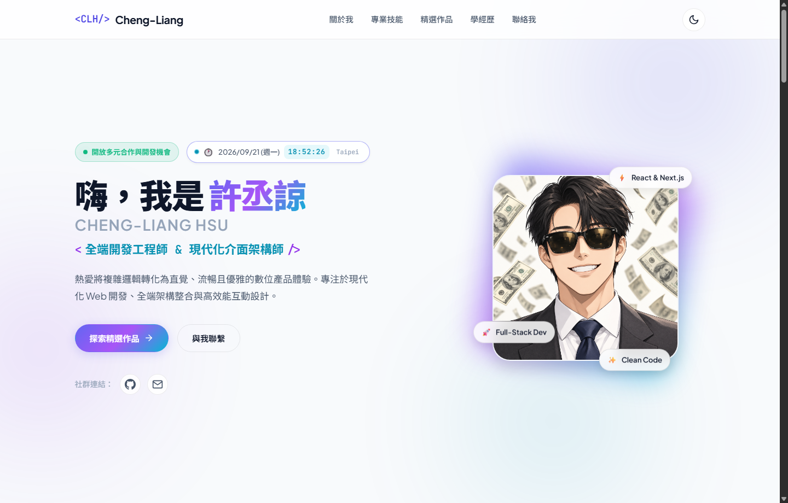

# 0914-5114050012-personalPage

這是 **Cheng-Liang Hsu (許丞諒)** 的個人作品集與履歷網站專案。

🔗 **線上展示網址 (GitHub Pages)**：[https://chenglianghsu.github.io/0914-5114050012-personalPage/](https://chenglianghsu.github.io/0914-5114050012-personalPage/)

---

## 📷 網頁預覽 (Website Preview)

### 🌙 深色模式 (Dark Mode)


### ☀️ 淺色模式 (Light Mode)


---

## 專案簡介

本專案採用純原生技術（Vanilla HTML5、CSS3、JavaScript ES6+）打造，無須繁瑣框架與建置步驟即可快速預覽與部署。

### 核心功能規範對應
- 👤 **Profile 個人檔案**：包含姓名（許丞諒）、專業形象照片 (`assets/avatar.jpg`)、個人背景經歷與開發哲學簡介。
- 🛠 **Skills 專業技能**：涵蓋前端開發、後端與資料庫、工具與維運等 12 項技能等級指示。
- 🚀 **Projects 精選專案**：包含 3 個精選作品（Nebula 雲端 SaaS 監控、Lumina AI 智能工作台、Core UI 設計系統），支援分類篩選與詳情彈窗。
- 🕐 **Live Clock 即時時鐘**：以 JavaScript 原生即時更新當前日期、星期與精確至秒的時鐘。
- 🎨 **Personal Design 風格設計**：現代科技深淺色主題切換、流光霓虹邊框、打字機動效、玻璃擬態 (Glassmorphism) 與全響應式 (RWD) 佈局。

---

## 專案架構

```text
.
├── index.html       # 網頁主架構與語意化內容
├── style.css        # 樣式表、設計 Tokens 與 RWD 佈局
├── script.js        # 互動行為、主題切換與表單邏輯
├── assets/          # 形象頭像、專案成果圖檔與網頁預覽截圖
│   ├── preview-dark.png   # 深色主題預覽圖
│   ├── preview-light.png  # 淺色主題預覽圖
│   ├── avatar.jpg         # 個人形象照片
│   └── project-*.jpg      # 精選專案展示圖
└── README.md        # 專案說明文件
```

---

## 本地開發與預覽

### 方法一：使用 Python 本地伺服器（推薦）
在專案根目錄開啟終端機，執行以下指令：
```bash
python -m http.server 5500
```
接著在瀏覽器打開：[http://localhost:5500](http://localhost:5500)

### 方法二：直接瀏覽器開啟
直接在檔案總管中雙擊 `index.html` 即可於瀏覽器檢視。
